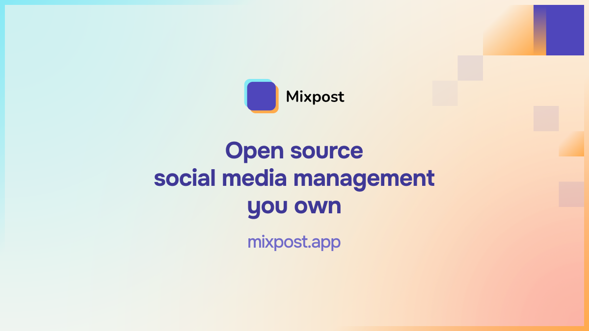

# Mixpost Enterprise

Launch your own white-labeled social media management SaaS and start generating revenue. Self-hosted software with no monthly fees, no limits, and full data privacy.

## Getting Started

A license code is required to activate Mixpost Enterprise. You will be prompted to enter it during installation.

Purchase a license at [mixpost.app](https://mixpost.app/pricing?utm_source=github&utm_medium=MixpostProTeamApp).

## Documentation

Full installation guide, configuration, and usage instructions are available at [docs.mixpost.app/enterprise](https://docs.mixpost.app/enterprise).

## Community

- [Discord](https://mixpost.app/discord)
- [Facebook Private Group](https://www.facebook.com/groups/getmixpost)

## More Info

Visit [mixpost.app](https://mixpost.app/?utm_source=github&utm_medium=MixpostProTeamApp) to learn more.
